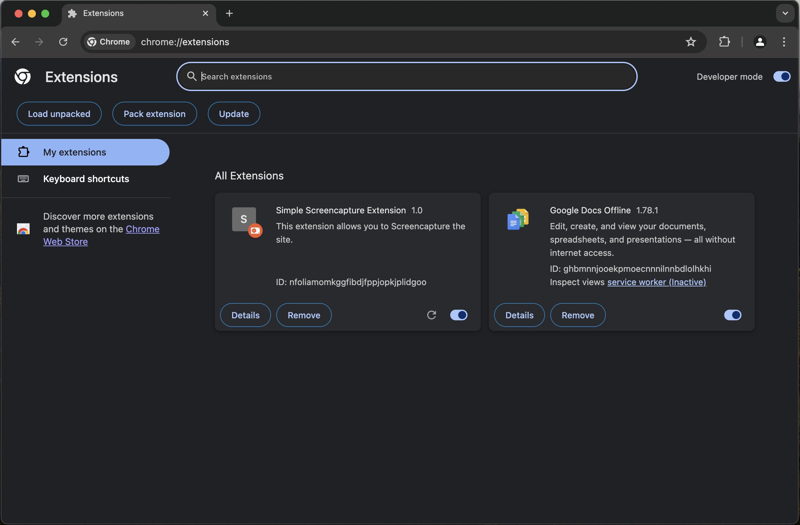
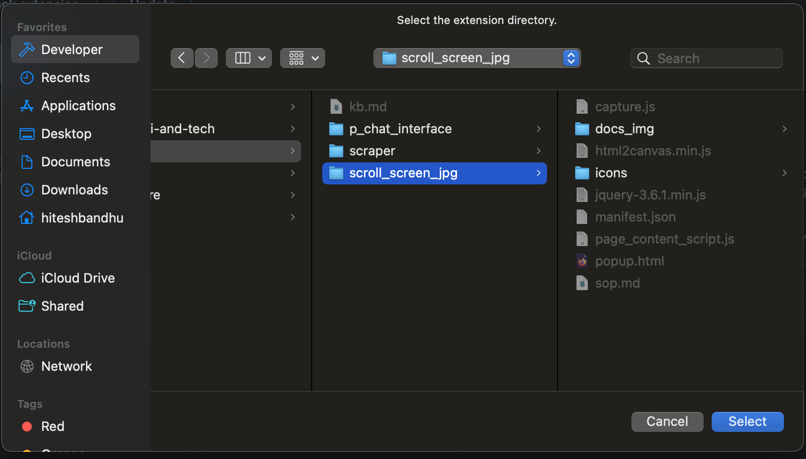
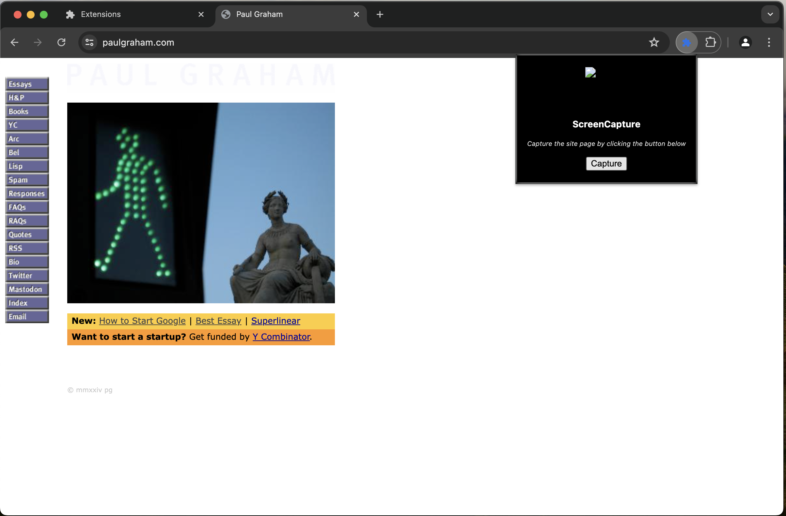

#### Screenshot Chrome Extension

#### URL FOR CODE REFERENCE : https://www.sourcecodester.com/tutorial/javascript/15906/creating-screencapture-chrome-extension-using-js-and-html2canvas-tutorial 

-- we used code from this website in our own code

### Here is the prompt used to generate the response in GPT
```txt
Make me a chrome extension to do the following in javascript : 

   - use selenium to take screenshot of the page
   - scroll one VH and take another screenshot
   - repeat until the whole screen is screenshoted vertically
   - then, combine those files vertically
   - save them in the downloads folder

-- use selenium and you can also use libraries as you want
-- i should see the file being downloaded in the download pane
-- make sure to handle errors
```

*🥹 the generated code from this was not useful, as gpt wasn't able to implement the downloads function, **so this approach was rejected***

---

### Prerequisites for coding this extension :
- JS, HTML and CSS knowledge
- VSCODE for coding the extension
- Chrome Dev Tools (for debugging and running the extension)


## Part 1 : Overview of the files

this is a great link to learnt he basic of extensions
https://www.freecodecamp.org/news/building-chrome-extension/

A Chrome extension typically consists of: 

1. **Manifest File (`manifest.json`)**: This file provides essential information about the extension, such as its name, version, permissions, and background scripts. 
2. **HTML File (`popup.html`)**: The UI of the extension, which users interact with. 
3. **JavaScript File (`popup.js`)**: Contains the functionality and logic of the extension. 
4. **Additional Files**: CSS for styling, images/icons, and libraries HTML2Canvas and Jquery (to inject js into html) for specific functionalities.

## Part 2 : Execution

***Step 1***: Create the Project Directory

Create a new directory named ScreenCaptureExtension. 

***Step 2***: Create the manifest.json File

Inside ScreenCaptureExtension, create a file named manifest.json. This is the content of the file

```json
{
      "manifest_version": 2,
      "name": "Screen Capture Extension",
      "version": "1.0",
      "description": "A simple screen capture extension using HTML2Canvas.",
      "browser_action": {
        "default_popup": "popup.html",
        "default_icon": "icons/icon16.svg"
      },
      "permissions": ["activeTab"]
}
    
```
The manifest file defines the extension's metadata and permissions. It includes the name, version, description, and specifies popup.html as the default popup UI.

<br>

***Step 3***: Create the popup.html File

In the same directory, create a file named popup.html. This is the code for the UI

```html
<!DOCTYPE html>
    <html>
      <head>
        <title>Screen Capture</title>
        <style>
          body { font-family: Arial, sans-serif; }
          #capture { margin: 10px; padding: 10px; background: #4CAF50; color: white; border: none; cursor: pointer; }
        </style>
      </head>
      <body>
        <button id="capture">Capture Screen</button>
        <script src="popup.js"></script>
      </body>
</html>
```
This HTML file creates a simple UI with a button to trigger the screen capture. It also links to the popup.js file.

<br>

***Step 4***: Create the popup.js File

In the same directory, create a file named popup.js.

```javascript
document.getElementById('capture').addEventListener('click', function() {
      chrome.tabs.captureVisibleTab(null, {}, function(dataUrl) {
        var img = new Image();
        img.src = dataUrl;
        document.body.appendChild(img);
      });
});
```
This JavaScript file adds an event listener, event listener is like a person who acts when something happens, like when you run towards the area when the emergency alarm hits, this type. It is added to the capture button. When clicked, it captures the visible part of the active tab and displays the captured image.

<br>

***Step 5***: Add an Icon

We needed an icon to display in the chrome navigation bar, so add a file with the same name we spcififed in the ```manifest.json``` along with the path. For eg, our path is ```icons/icon16.svg ```

## Part 3 : Testing/Running the extension

1. Open Chrome and navigate to `chrome://extensions/`



2. Enable "Developer mode" using the toggle switch in the top-right corner.

3. Click "Load unpacked" and select the `ScreenCaptureExtension` directory.”



4. Run the extension from the chrome tab




---
#### All the required steps for the SOP are done